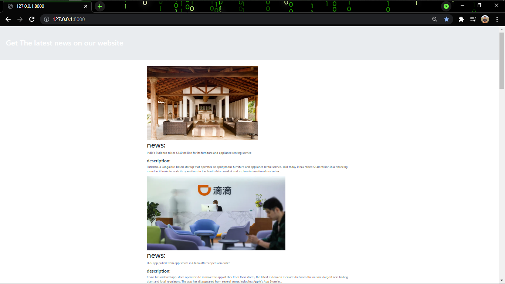
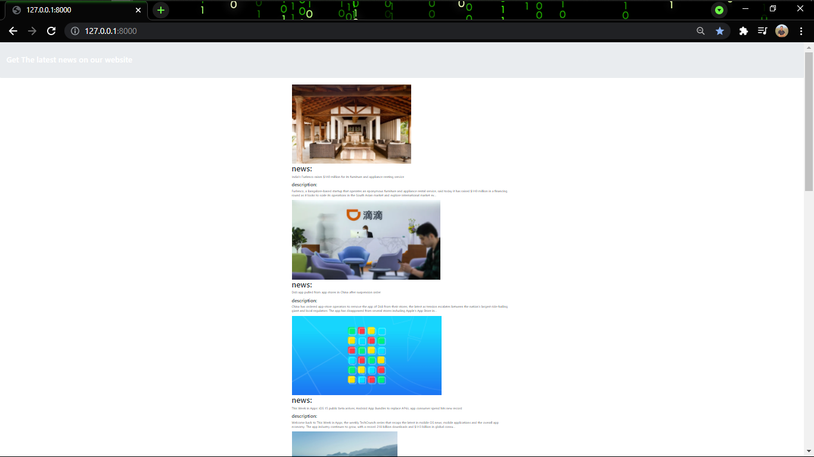

# Django-News-App

#1. Create project and app
django-admin startproject newsproject . 
django-admin startapp newsapp

#2.install newsapi 
pip install newsapi-python

#3.add app in settings 
INSTALLED_APPS = [ 
    'newsapp',	#<----------------- 
    'django.contrib.admin', 
    'django.contrib.auth', 
    'django.contrib.contenttypes', 
    'django.contrib.sessions', 
    'django.contrib.messages', 
    'django.contrib.staticfiles', 
]

#4. join template 
import os 

TEMPLATES = [ 
    {
        'BACKEND': 'django.template.backends.django.DjangoTemplates', 
        'DIRS': [os.path.join(BASE_DIR, "templates")],		#<-------------- 
        'APP_DIRS': True, 
        'OPTIONS': { 
            'context_processors': [ 
                'django.template.context_processors.debug', 
                'django.template.context_processors.request', 
                'django.contrib.auth.context_processors.auth', 
                'django.contrib.messages.context_processors.messages', 
            ],
        },
    }, 
]

#5.newsapp/views.py

# importing api
from django.shortcuts import render 
from newsapi import NewsApiClient

# Create your views here.
def index(request): 
	
	newsapi = NewsApiClient(api_key ='426c4bdc8ea540e0b2e73967c105f457')	#<-----(Create your API key) 
	top = newsapi.get_top_headlines(sources ='techcrunch')

	l = top['articles']
	desc =[]
	news =[]
	img =[]

	for i in range(len(l)):
		f = l[i]
		news.append(f['title'])
		desc.append(f['description'])
		img.append(f['urlToImage'])
	mylist = zip(news, desc, img)

	return render(request, 'index.html', context ={"mylist":mylist})

#6. Create templates/index.html,

<!DOCTYPE html>
<html lang="en" dir="ltr">
<head>
	<meta charset="utf-8">
	<title></title>

<link rel="stylesheet" href="https://stackpath.bootstrapcdn.com/bootstrap/4.3.1/css/bootstrap.min.css" integrity="sha384-ggOyR0iXCbMQv3Xipma34MD+dH/1fQ784/j6cY/iJTQUOhcWr7x9JvoRxT2MZw1T" crossorigin="anonymous">
<!-- Optional theme -->
</head>
<body>
	

	<h1 style ="color:white">
Get The latest news on our website
	</h1>

	

	

	
			
			<h1>news:</h1> {{ new }}
			{{ value|linebreaks }}

			<h4>description:</h4>{{ des }}
			{{ value|linebreaks }}

	
	

</body>
</html>

#7. newsproject/urls.py

from django.contrib import admin 
from django.urls import path 
from newsapp import views 

urlpatterns = [ 
path('', views.index, name ='index'), 
	path('admin/', admin.site.urls), 
]

#8.Run the project 
Python manage.py runserver 

and go http://127.0.0.1:8000/

